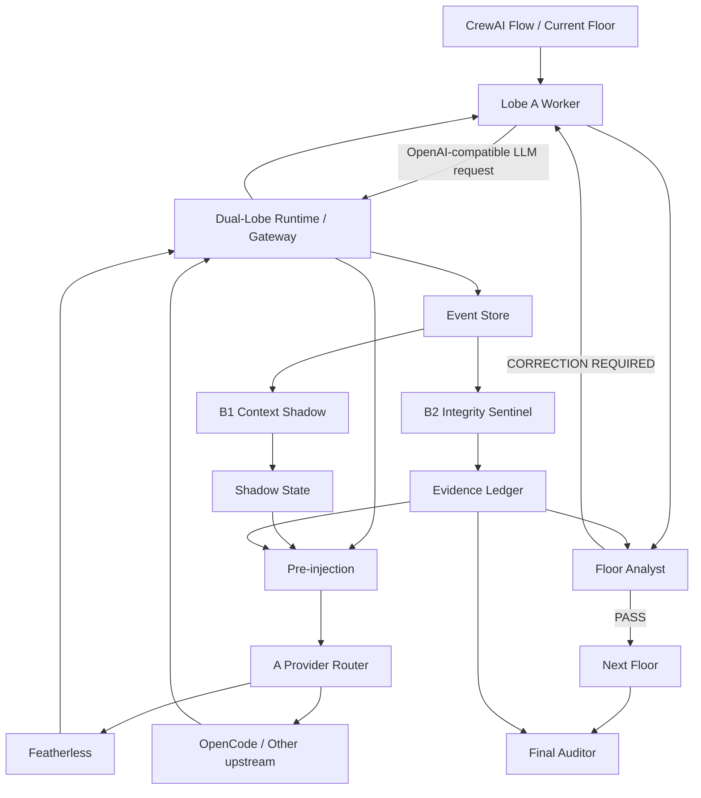

# Dual-Lobe Production Architecture and Platform Integration

## Scope

This reference translates the Dual-Lobe concept into a production architecture for autonomous research/build Workers orchestrated by CrewAI. It preserves the distinction between the productive Worker, the shadow/context layer, the integrity layer, the Floor Analyst, and the Final Auditor.

## Architectural rule

Dual-Lobe is a runtime cognitive architecture around each Worker, not merely an HTTP gateway and not simply another sequential CrewAI task. The runtime/gateway is the mechanism that can intercept Worker model calls, inject bounded Lobe-B context before later inference cycles, proxy to explicitly configured providers, and trigger post-pass analysis without making B the primary executor.

## Responsibilities

| Component | Responsibility | Verdict authority |
|---|---|---|
| Lobe A — Worker | Complete the full research/build assignment and produce the deliverable | No |
| B1 — Context Shadow | Expand the world model, discover prior art, changed constraints, alternatives, hidden assumptions, and blocker solutions | No |
| B2 — Integrity Sentinel | Reconcile consequential claims against observable evidence, artifacts, commits, tests, URLs, and runtime state | No |
| Floor Analyst | Judge floor correctness, completeness, integrity, design quality, and readiness | Yes |
| Final Auditor | Independent terminal build decision | Final |

## Context expansion

B1 exists to counter tunnel vision. It continuously asks whether the Worker is solving the right problem, whether something already exists, whether an API/specification/provider rule changed, whether an approach is obsolete, which assumptions are being treated as facts, what production edge cases are missing, and what the latest failure reveals.

B1 should produce discoveries and decision-relevant context rather than another final answer.

## Integrity reconciliation

B2 classifies material claims as VERIFIED, PARTIALLY VERIFIED, UNVERIFIED, CONTRADICTED, or STALE. It asks whether files and commits exist, whether tests actually ran, whether observed output matches the claimed result, whether citations support the statement, whether an integration really worked, and whether uncertainty was silently converted into certainty.

The Worker cannot mark its own claims VERIFIED and cannot edit the evidence ledger.

## Operational oversight

The Worker should know independent oversight is active and that evidence is maintained outside its writable context. Unsupported claims do not become facts because they are stated confidently, and critical evidence debt can affect acceptance.

Do not expose every Sentinel heuristic, random audit probability, private classifier prompt, or complete B state. The useful asymmetry is that B observes A's externally visible execution, A knows oversight exists, and A does not control what is audited.

## Target runtime



The gateway should return A promptly after the upstream response and enqueue B post-pass work separately. New B state is consumed on the next Worker inference.

## Real-time semantics

The unit of real-time intervention is the next inference/tool cycle. A gateway cannot rewrite an already-running model completion. Therefore periodic wall-clock messages such as `I AM WATCHING` are not useful. Oversight should be state-triggered and inference-aware.

Example pulse:

```text
[OVERSIGHT]
active | verified: 14 | unverified: 2 | contradicted: 0
```

Example evidence challenge:

```text
[EVIDENCE CHALLENGE]
Claim: Authentication tests now pass.
Observed: source modification VERIFIED; test invocation VERIFIED; successful result NOT OBSERVED.
Status: PARTIALLY VERIFIED
Evidence debt: +1
```

Example context intervention:

```text
[SHADOW-INJECT][HIGH]
A new external constraint materially changes the current implementation assumption. Re-check the affected design against verified sources before continuing.
```

## Integration preflight

Before installing the full runtime, inspect how the deployed CrewAI project actually resolves declarative `llm.model` fields, provider/base-URL configuration, tool connections, and runtime state. Do not invent an LLM factory or provider boundary that is not present in the project.

For declarative CrewAI projects, trace the actual connection path first. A provider-prefixed model string by itself is not proof of the final upstream route.

## Full implementation sequence

1. Baseline the existing pipeline and provider routing.
2. Preserve full-accountability Workers, Floor Analysts, and Final Auditor semantics.
3. Define explicit Worker, Analyst, Auditor, and Shadow model routes.
4. Add the Worker-facing OpenAI-compatible gateway boundary.
5. Add provider adapters rather than hard-coded provider logic.
6. Correlate run, floor, attempt, Worker, call sequence, and trace IDs.
7. Add durable append-only event/evidence storage.
8. Add B bootstrap before the first Worker cycle.
9. Add bounded pre-pass context selection.
10. Add asynchronous post-pass analysis.
11. Add state-triggered active oversight and claim challenges.
12. Feed evidence summaries to Analysts without giving B verdict authority.
13. Add fail-open, recursion-bypass, security, queueing, timeout, and redaction controls.
14. Instrument latency, queue depth, token use, evidence debt, contradictions, retries, and provider routing.
15. Roll out observation-only first, then research Workers, then build Workers.
16. Harden persistence and concurrency only after behavior is proven.

## CrewAI Platform-compatible subset

A pure declarative CrewAI Flow cannot honestly provide per-inference gateway interception, asynchronous shadow post-passes, or an external append-only evidence ledger by itself. The platform-native approximation is therefore:

```text
Lobe B Context Shadow
  -> Lobe A Worker
  -> Lobe B Integrity Sentinel
  -> Floor Analyst
```

Repeat that sequence for each correction attempt. Add an explicit active-oversight notice to the Worker, keep B output structured and bounded, preserve the Worker deliverable inside the integrity packet so the Analyst sees both the work and its evidence status, and leave the Final Auditor independent.

This approximation is useful now because it broadens context before each attempt, gives the next Worker correction independent blocker/context input, and prevents the Analyst from relying solely on the Worker's own narrative. It must not be mislabeled as the full per-inference Dual-Lobe runtime.

## Proof standard

Do not accept `two models ran` or `gateway listening` as proof. The production standard requires demonstrable context transfer to later A cycles, independent evidence reconciliation, evidence debt for unsupported claims, artifact-backed resolution of that debt, visible oversight, failure isolation, Analyst independence, and explicit provider routing.
